# 3-way merge case atlas — ordered trees & graphs (IDML)

> Static, searchable companion to the [interactive HTML atlas](merge-case-atlas.html). The diagrams below are repository-local renderings of that source, so this document remains readable in Markdown viewers that do not execute JavaScript.

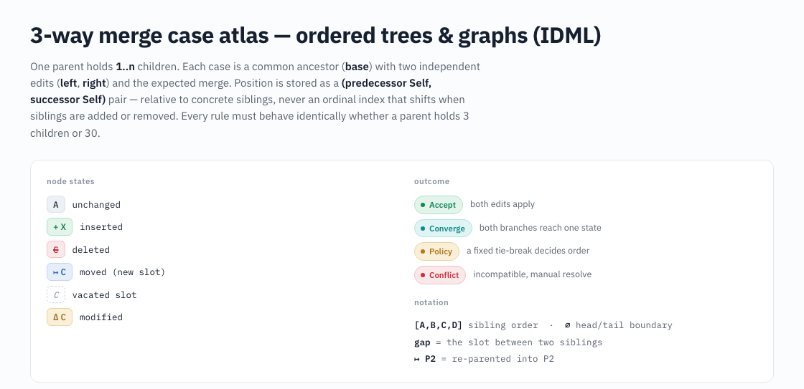

One parent holds **1..n** children. Each case starts from a common ancestor (**base**), applies two independent edits (**left** and **right**), and records the expected merge. Position is represented by a **(predecessor `Self`, successor `Self`)** pair relative to concrete siblings, never by a shifting ordinal index. Every rule must behave identically whether a parent holds 3 children or 30.

## Legend and notation

- Node state: unchanged `A`; inserted `+X`; deleted `−C`; moved `↦C`; vacated slot `(C: vacated)`; modified `ΔC`.
- Outcome: **Accept** applies both edits; **Converge** means both branches reach one state; **Policy** requires a fixed tie-break; **Conflict** requires manual resolution; **Robustness** is an invariant rather than a fixed verdict.
- `[A B C D]` denotes sibling order; `∅` is a head/tail boundary; a *gap* is the slot between siblings; `↦ P2` means re-parented into `P2`.
- Text notation: `~~deleted~~`, `{+inserted+}`, `{~modified~}`, and `{!overlap!}`.

## Contents

- [N1 — Single-side anchor correctness](#n1)
- [N2 — Concurrent insertion — gap arbitration](#n2)
- [N3 — Concurrent deletion](#n3)
- [N4 — Move interaction — same-parent reorder](#n4)
- [N5 — Anchor failure / cascade](#n5)
- [N6 — Delete vs modify — structure vs content](#n6)
- [N7 — Cross-parent move / re-parenting (graph, not pure tree)](#n7)
- [N8 — Reference-driven order (IDML edges beyond parent–child)](#n8)
- [N9 — Composite edit-script merge](#n9)
- [N10 — Degenerate cases & scale](#n10)
- [N11 — Text child nodes (separate track)](#n11)

## N1 — Single-side anchor correctness

Validate the anchor model itself. Not conflict cases — all accept. Boundary anchors (null predecessor / successor) behave differently from a mid gap once n≥3, so they are listed separately.

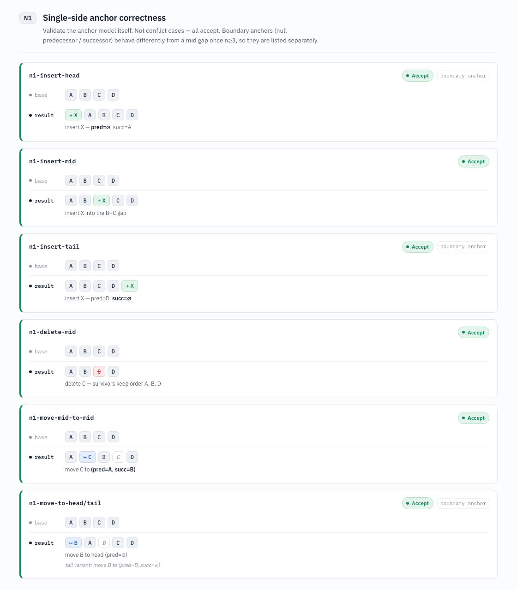

### `n1-insert-head` — Accept · boundary anchor

- **base**: [A B C D]
- **result**: [+X A B C D]; insert X — pred=∅, succ=A

### `n1-insert-mid` — Accept

- **base**: [A B C D]
- **result**: [A B +X C D]; insert X into the B–C gap

### `n1-insert-tail` — Accept · boundary anchor

- **base**: [A B C D]
- **result**: [A B C D +X]; insert X — pred=D, succ=∅

### `n1-delete-mid` — Accept

- **base**: [A B C D]
- **result**: [A B −C D]; delete C — survivors keep order A, B, D

### `n1-move-mid-to-mid` — Accept

- **base**: [A B C D]
- **result**: [A ↦C B (C: vacated) D]; move C to (pred=A, succ=B)

### `n1-move-to-head/tail` — Accept · boundary anchor

- **base**: [A B C D]
- **result**: [↦B A (B: vacated) C D]; move B to head (pred=∅); tail variant: move B to (pred=D, succ=∅)

## N2 — Concurrent insertion — gap arbitration

The only category where content cannot decide order. Same-gap outcomes need a fixed, deterministic tie-break; otherwise two "correct" implementations disagree. Multi-insert (kvm) and intra-branch chains appear only at n≥3.

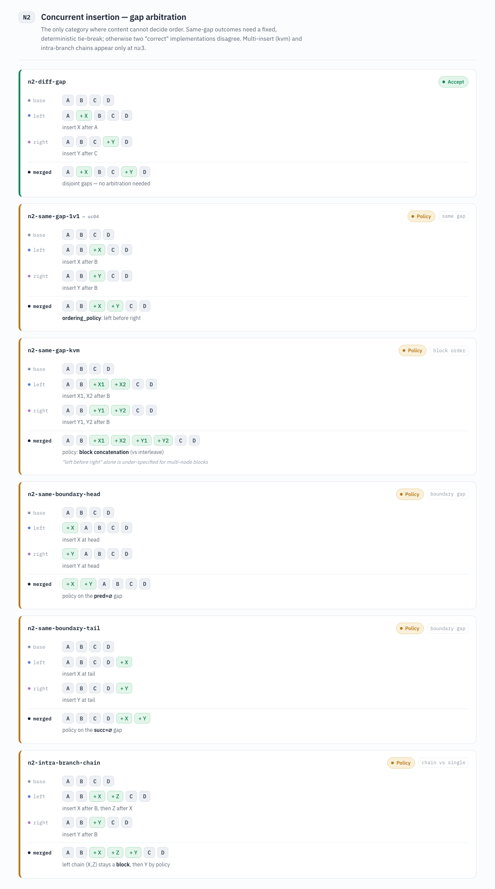

### `n2-diff-gap` — Accept

- **base**: [A B C D]
- **left**: [A +X B C D]; insert X after A
- **right**: [A B C +Y D]; insert Y after C
- **merged**: [A +X B C +Y D]; disjoint gaps — no arbitration needed

### `n2-same-gap-1v1` — Policy · same gap · base atlas: `uc04`

- **base**: [A B C D]
- **left**: [A B +X C D]; insert X after B
- **right**: [A B +Y C D]; insert Y after B
- **merged**: [A B +X +Y C D]; ordering_policy: left before right

### `n2-same-gap-kvm` — Policy · block order

- **base**: [A B C D]
- **left**: [A B +X1 +X2 C D]; insert X1, X2 after B
- **right**: [A B +Y1 +Y2 C D]; insert Y1, Y2 after B
- **merged**: [A B +X1 +X2 +Y1 +Y2 C D]; policy: block concatenation (vs interleave); "left before right" alone is under-specified for multi-node blocks

### `n2-same-boundary-head` — Policy · boundary gap

- **base**: [A B C D]
- **left**: [+X A B C D]; insert X at head
- **right**: [+Y A B C D]; insert Y at head
- **merged**: [+X +Y A B C D]; policy on the pred=∅ gap

### `n2-same-boundary-tail` — Policy · boundary gap

- **base**: [A B C D]
- **left**: [A B C D +X]; insert X at tail
- **right**: [A B C D +Y]; insert Y at tail
- **merged**: [A B C D +X +Y]; policy on the succ=∅ gap

### `n2-intra-branch-chain` — Policy · chain vs single

- **base**: [A B C D]
- **left**: [A B +X +Z C D]; insert X after B, then Z after X
- **right**: [A B +Y C D]; insert Y after B
- **merged**: [A B +X +Z +Y C D]; left chain (X,Z) stays a block, then Y by policy

## N3 — Concurrent deletion

Deleting the same node converges rather than conflicts. Deleting different nodes composes. Adjacency of the remaining survivors must be preserved.

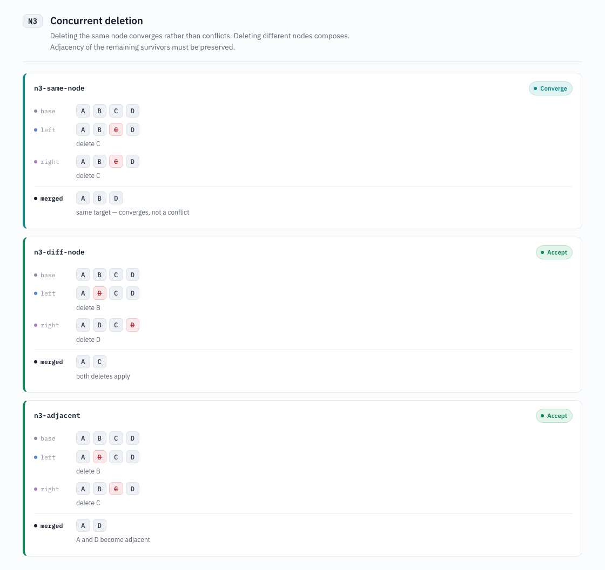

### `n3-same-node` — Converge

- **base**: [A B C D]
- **left**: [A B −C D]; delete C
- **right**: [A B −C D]; delete C
- **merged**: [A B D]; same target — converges, not a conflict

### `n3-diff-node` — Accept

- **base**: [A B C D]
- **left**: [A −B C D]; delete B
- **right**: [A B C −D]; delete D
- **merged**: [A C]; both deletes apply

### `n3-adjacent` — Accept

- **base**: [A B C D]
- **left**: [A −B C D]; delete B
- **right**: [A B −C D]; delete C
- **merged**: [A D]; A and D become adjacent

## N4 — Move interaction — same-parent reorder

Moving the same node into different gaps is a move-move conflict (generalizes uc05). Moving into the same gap converges. A move and an insert landing in the same gap is a policy call.

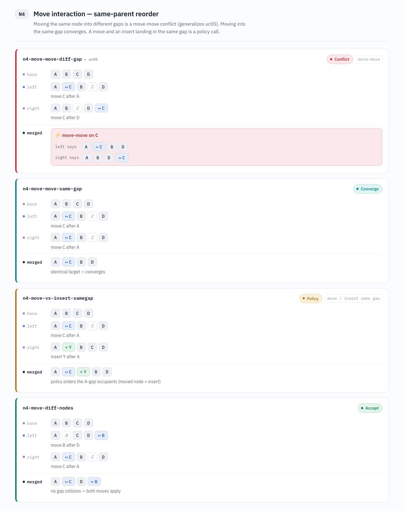

### `n4-move-move-diff-gap` — Conflict · move-move · base atlas: `uc05`

- **base**: [A B C D]
- **left**: [A ↦C B (C: vacated) D]; move C after A
- **right**: [A B (C: vacated) D ↦C]; move C after D
- **merged**: Conflict: move-move on C; left says [A ↦C B D]; right says [A B D ↦C]

### `n4-move-move-same-gap` — Converge

- **base**: [A B C D]
- **left**: [A ↦C B (C: vacated) D]; move C after A
- **right**: [A ↦C B (C: vacated) D]; move C after A
- **merged**: [A ↦C B D]; identical target — converges

### `n4-move-vs-insert-samegap` — Policy · move / insert same gap

- **base**: [A B C D]
- **left**: [A ↦C B (C: vacated) D]; move C after A
- **right**: [A +Y B C D]; insert Y after A
- **merged**: [A ↦C +Y B D]; policy orders the A-gap occupants (moved node + insert)

### `n4-move-diff-nodes` — Accept

- **base**: [A B C D]
- **left**: [A (B: vacated) C D ↦B]; move B after D
- **right**: [A ↦C B (C: vacated) D]; move C after A
- **merged**: [A ↦C D ↦B]; no gap collision — both moves apply

## N5 — Anchor failure / cascade

A neighbor used as an anchor is deleted or moved by the other branch, so the anchor dangles. This is the core new problem at n≥3. Record both predecessor and successor; on failure fall back to the nearest surviving neighbor.

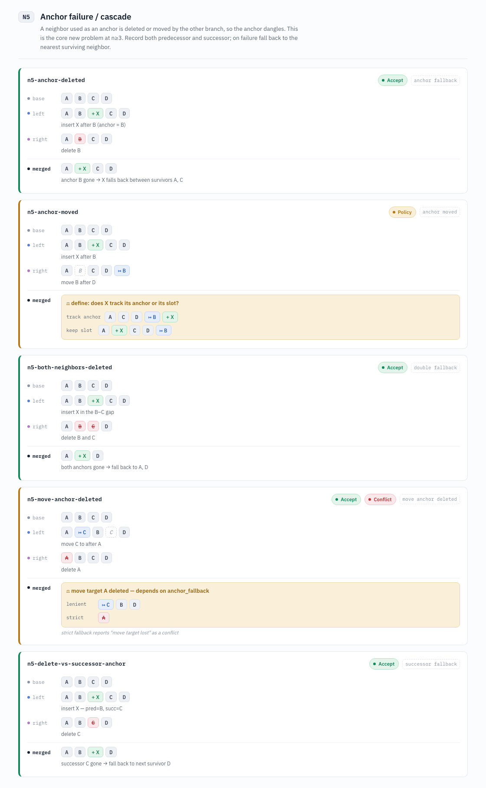

### `n5-anchor-deleted` — Accept · anchor fallback

- **base**: [A B C D]
- **left**: [A B +X C D]; insert X after B (anchor = B)
- **right**: [A −B C D]; delete B
- **merged**: [A +X C D]; anchor B gone → X falls back between survivors A, C

### `n5-anchor-moved` — Policy · anchor moved

- **base**: [A B C D]
- **left**: [A B +X C D]; insert X after B
- **right**: [A (B: vacated) C D ↦B]; move B after D
- **merged**: Policy: define: does X track its anchor or its slot?; track anchor [A C D ↦B +X]; keep slot [A +X C D ↦B]

### `n5-both-neighbors-deleted` — Accept · double fallback

- **base**: [A B C D]
- **left**: [A B +X C D]; insert X in the B–C gap
- **right**: [A −B −C D]; delete B and C
- **merged**: [A +X D]; both anchors gone → fall back to A, D

### `n5-move-anchor-deleted` — Accept · Conflict · move anchor deleted

- **base**: [A B C D]
- **left**: [A ↦C B (C: vacated) D]; move C to after A
- **right**: [−A B C D]; delete A
- **merged**: Policy: move target A deleted — depends on anchor_fallback; lenient [↦C B D]; strict [−A]; strict fallback reports "move target lost" as a conflict

### `n5-delete-vs-successor-anchor` — Accept · successor fallback

- **base**: [A B C D]
- **left**: [A B +X C D]; insert X — pred=B, succ=C
- **right**: [A B −C D]; delete C
- **merged**: [A B +X D]; successor C gone → fall back to next survivor D

## N6 — Delete vs modify — structure vs content

One branch removes a node while the other changes it. There is no safe merge — a discarded change or a resurrected node either way. Generalizes uc06 / uc06b, including cascades through a deleted container.

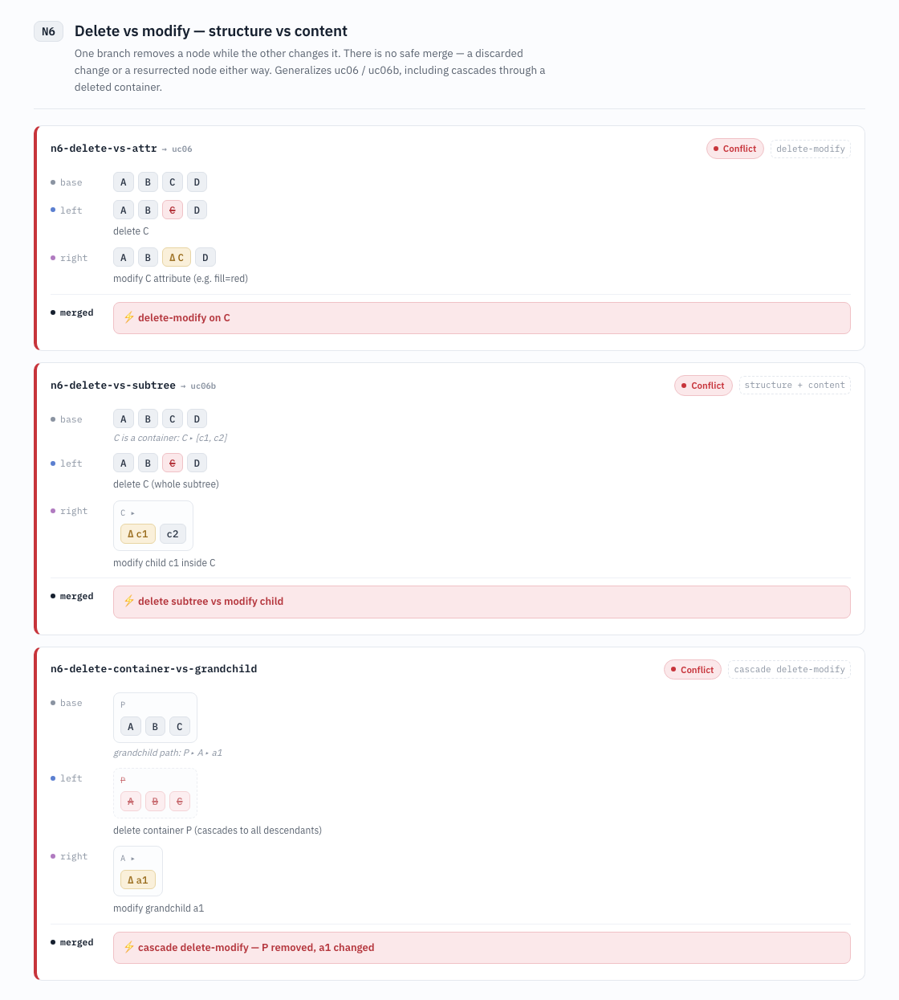

### `n6-delete-vs-attr` — Conflict · delete-modify · base atlas: `uc06`

- **base**: [A B C D]
- **left**: [A B −C D]; delete C
- **right**: [A B ΔC D]; modify C attribute (e.g. fill=red)
- **merged**: Conflict: delete-modify on C

### `n6-delete-vs-subtree` — Conflict · structure + content · base atlas: `uc06b`

- **base**: [A B C D]; C is a container: C ▸ [c1, c2]
- **left**: [A B −C D]; delete C (whole subtree)
- **right**: C ▸: [Δc1 c2]; modify child c1 inside C
- **merged**: Conflict: delete subtree vs modify child

### `n6-delete-container-vs-grandchild` — Conflict · cascade delete-modify

- **base**: P: [A B C]; grandchild path: P ▸ A ▸ a1
- **left**: P: [−A −B −C]; delete container P (cascades to all descendants)
- **right**: A ▸: [Δa1]; modify grandchild a1
- **merged**: Conflict: cascade delete-modify — P removed, a1 changed

## N7 — Cross-parent move / re-parenting (graph, not pure tree)

Nodes leave one parent and join another. Beyond ordered-tree territory: two branches re-parenting the same node conflict, and mutual re-parenting can form a cycle — a graph-only case that a tree never produces and that needs explicit detection.

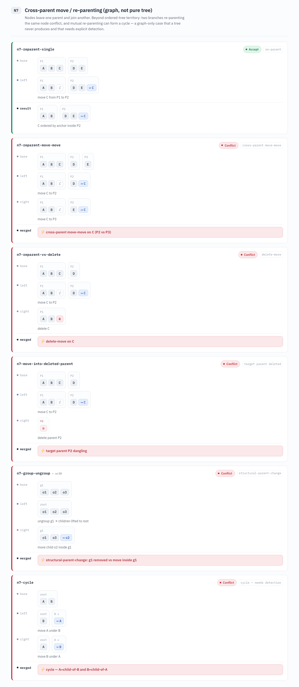

### `n7-reparent-single` — Accept · re-parent

- **base**: P1: [A B C]; P2: [D E]
- **left**: P1: [A B (C: vacated)]; P2: [D E ↦C]; move C from P1 to P2
- **result**: P1: [A B]; P2: [D E ↦C]; C ordered by anchor inside P2

### `n7-reparent-move-move` — Conflict · cross-parent move-move

- **base**: P1: [A B C]; P2: [D]; P3: [E]
- **left**: P1: [A B (C: vacated)]; P2: [D ↦C]; move C to P2
- **right**: P1: [A B (C: vacated)]; P3: [E ↦C]; move C to P3
- **merged**: Conflict: cross-parent move-move on C (P2 vs P3)

### `n7-reparent-vs-delete` — Conflict · delete-move

- **base**: P1: [A B C]; P2: [D]
- **left**: P1: [A B (C: vacated)]; P2: [D ↦C]; move C to P2
- **right**: P1: [A B −C]; delete C
- **merged**: Conflict: delete-move on C

### `n7-move-into-deleted-parent` — Conflict · target parent deleted

- **base**: P1: [A B C]; P2: [D]
- **left**: P1: [A B (C: vacated)]; P2: [D ↦C]; move C to P2
- **right**: P2: [−D]; delete parent P2
- **merged**: Conflict: target parent P2 dangling

### `n7-group-ungroup` — Conflict · structural-parent-change · base atlas: `uc10`

- **base**: g1: [o1 o2 o3]
- **left**: root: [o1 o2 o3]; ungroup g1 → children lifted to root
- **right**: g1: [o1 o3 ↦o2]; move child o2 inside g1
- **merged**: Conflict: structural-parent-change: g1 removed vs move inside g1

### `n7-cycle` — Conflict · cycle — needs detection

- **base**: root: [A B]
- **left**: root: [B]; B ▸: [↦A]; move A under B
- **right**: root: [A]; A ▸: [↦B]; move B under A
- **merged**: Conflict: cycle — A↦child-of-B and B↦child-of-A

## N8 — Reference-driven order (IDML edges beyond parent–child)

Order and identity carried by references — thread links (Previous/Next TextFrame), ParentStory — not by sibling position. Divergent reference targets conflict; a reference change vs a sibling move must stay consistent. Systematizes uc11 / uc12 / uc13.

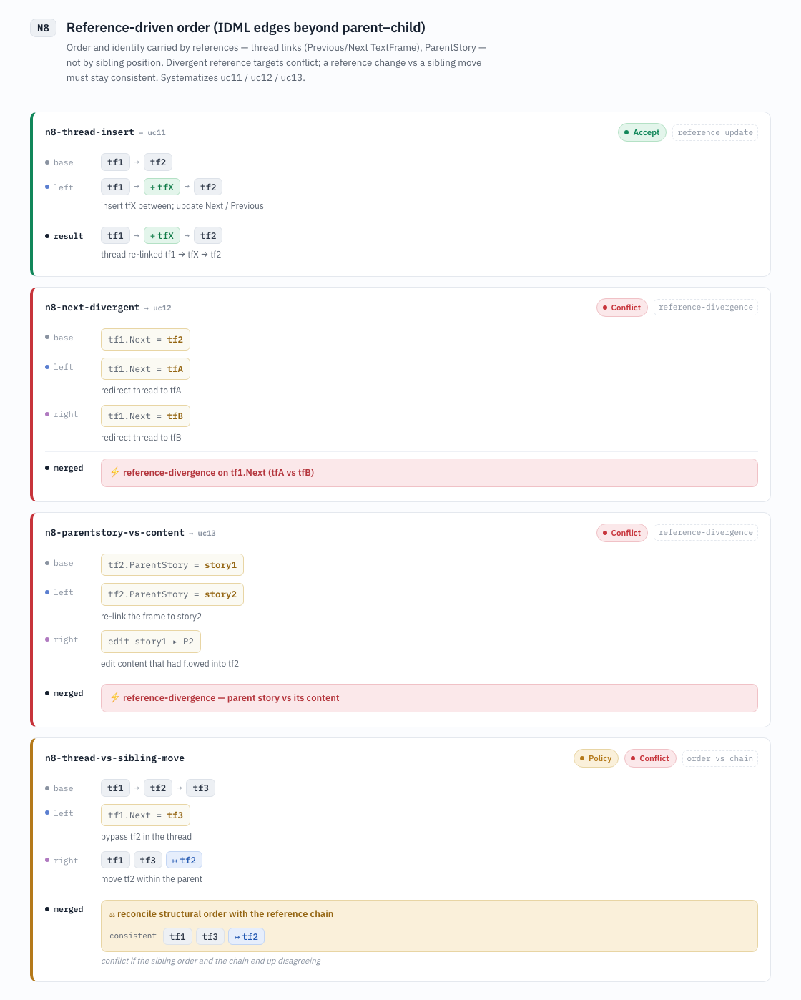

### `n8-thread-insert` — Accept · reference update · base atlas: `uc11`

- **base**: [tf1 → tf2]
- **left**: [tf1 → +tfX → tf2]; insert tfX between; update Next / Previous
- **result**: [tf1 → +tfX → tf2]; thread re-linked tf1 → tfX → tf2

### `n8-next-divergent` — Conflict · reference-divergence · base atlas: `uc12`

- **base**: tf1.Next = tf2
- **left**: tf1.Next = tfA; redirect thread to tfA
- **right**: tf1.Next = tfB; redirect thread to tfB
- **merged**: Conflict: reference-divergence on tf1.Next (tfA vs tfB)

### `n8-parentstory-vs-content` — Conflict · reference-divergence · base atlas: `uc13`

- **base**: tf2.ParentStory = story1
- **left**: tf2.ParentStory = story2; re-link the frame to story2
- **right**: edit story1 ▸ P2; edit content that had flowed into tf2
- **merged**: Conflict: reference-divergence — parent story vs its content

### `n8-thread-vs-sibling-move` — Policy · Conflict · order vs chain

- **base**: [tf1 → tf2 → tf3]
- **left**: tf1.Next = tf3; bypass tf2 in the thread
- **right**: [tf1 tf3 ↦tf2]; move tf2 within the parent
- **merged**: Policy: reconcile structural order with the reference chain; consistent [tf1 tf3 ↦tf2]; conflict if the sibling order and the chain end up disagreeing

## N9 — Composite edit-script merge

Align base / left / right Self sequences with LCS/diff3, then merge both edit scripts. Disjoint scripts compose. Scripts touching the same anchor conflict — this probes the granularity of conflict detection. Intra-script order must survive.

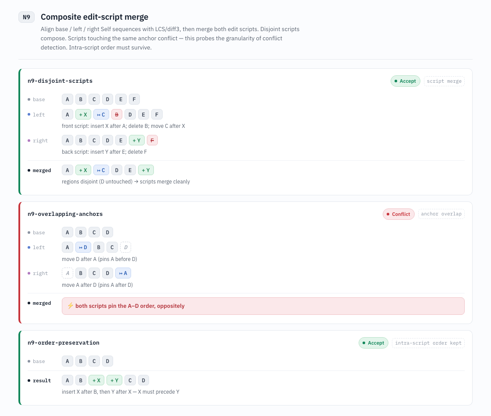

### `n9-disjoint-scripts` — Accept · script merge

- **base**: [A B C D E F]
- **left**: [A +X ↦C −B D E F]; front script: insert X after A; delete B; move C after X
- **right**: [A B C D E +Y −F]; back script: insert Y after E; delete F
- **merged**: [A +X ↦C D E +Y]; regions disjoint (D untouched) → scripts merge cleanly

### `n9-overlapping-anchors` — Conflict · anchor overlap

- **base**: [A B C D]
- **left**: [A ↦D B C (D: vacated)]; move D after A (pins A before D)
- **right**: [(A: vacated) B C D ↦A]; move A after D (pins A after D)
- **merged**: Conflict: both scripts pin the A–D order, oppositely

### `n9-order-preservation` — Accept · intra-script order kept

- **base**: [A B C D]
- **result**: [A B +X +Y C D]; insert X after B, then Y after X — X must precede Y

## N10 — Degenerate cases & scale

One-child and empty parents exercise the boundary gaps. The scale check confirms the anchor model introduces no new logic as sibling count grows — same operation, same result at n=3, 10, 30.

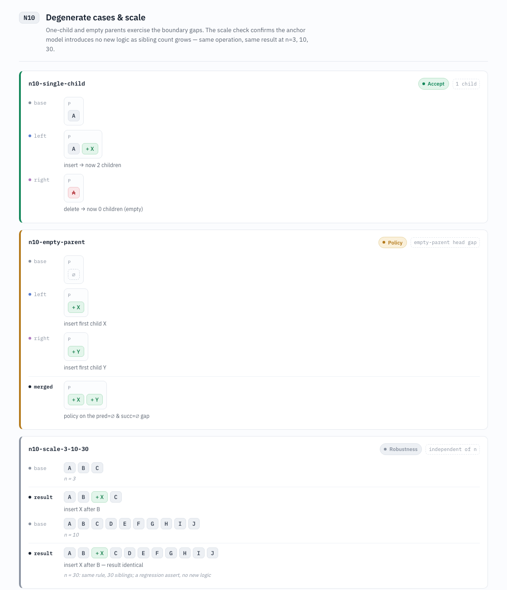

### `n10-single-child` — Accept · 1 child

- **base**: P: [A]
- **left**: P: [A +X]; insert → now 2 children
- **right**: P: [−A]; delete → now 0 children (empty)

### `n10-empty-parent` — Policy · empty-parent head gap

- **base**: P: [∅]
- **left**: P: [+X]; insert first child X
- **right**: P: [+Y]; insert first child Y
- **merged**: P: [+X +Y]; policy on the pred=∅ & succ=∅ gap

### `n10-scale-3-10-30` — Robustness · independent of n

- **base**: [A B C]; n = 3
- **result**: [A B +X C]; insert X after B
- **base**: [A B C D E F G H I J]; n = 10
- **result**: [A B +X C D E F G H I J]; insert X after B — result identical; n = 30: same rule, 30 siblings; a regression assert, no new logic

## N11 — Text child nodes (separate track)

ParagraphStyleRange / CharacterStyleRange have no stable Self — style slices are re-cut on re-export. Neighbor anchors do not apply; alignment is by position + content (LCS over tokens). Build these apart from the object cases (uc07 / uc08 / uc08b).

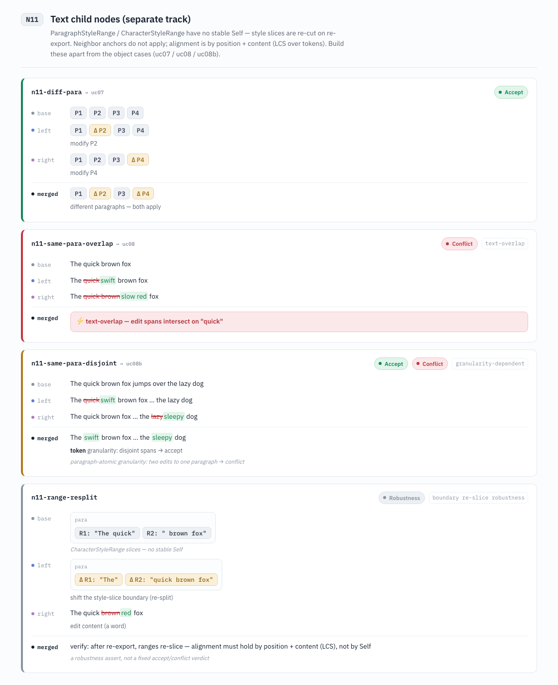

### `n11-diff-para` — Accept · base atlas: `uc07`

- **base**: [P1 P2 P3 P4]
- **left**: [P1 ΔP2 P3 P4]; modify P2
- **right**: [P1 P2 P3 ΔP4]; modify P4
- **merged**: [P1 ΔP2 P3 ΔP4]; different paragraphs — both apply

### `n11-same-para-overlap` — Conflict · text-overlap · base atlas: `uc08`

- **base**: The quick brown fox
- **left**: The ~~quick~~{+swift+} brown fox
- **right**: The ~~quick brown~~{+slow red+} fox
- **merged**: Conflict: text-overlap — edit spans intersect on "quick"

### `n11-same-para-disjoint` — Accept · Conflict · granularity-dependent · base atlas: `uc08b`

- **base**: The quick brown fox jumps over the lazy dog
- **left**: The ~~quick~~{+swift+} brown fox … the lazy dog
- **right**: The quick brown fox … the ~~lazy~~{+sleepy+} dog
- **merged**: The {+swift+} brown fox … the {+sleepy+} dog; token granularity: disjoint spans → accept; paragraph-atomic granularity: two edits to one paragraph → conflict

### `n11-range-resplit` — Robustness · boundary re-slice robustness

- **base**: para: [R1: "The quick" R2: " brown fox"]; CharacterStyleRange slices — no stable Self
- **left**: para: [ΔR1: "The" ΔR2: "quick brown fox"]; shift the style-slice boundary (re-split)
- **right**: The quick ~~brown~~{+red+} fox; edit content (a word)
- **merged**: verify: after re-export, ranges re-slice — alignment must hold by position + content (LCS), not by Self; a robustness assert, not a fixed accept/conflict verdict

## Corpus mapping

The genuinely new categories that cannot be reasoned about from a two-child intuition are:

- `N2`: same-gap multi-insert and intra-branch chains.
- `N5`: anchor-fallback cascades.
- `N7-cycle`: graph-only cycle detection.
- `N8`: reference/order consistency.
- `N9`: script-overlap granularity.

Store executable fixtures as `case-name/{base,left,right}.idml` plus `expected.json`, with the keys `ordering_policy`, `anchor_fallback`, and `conflict_type`.
